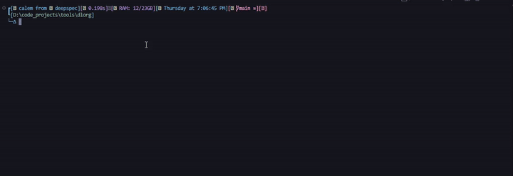
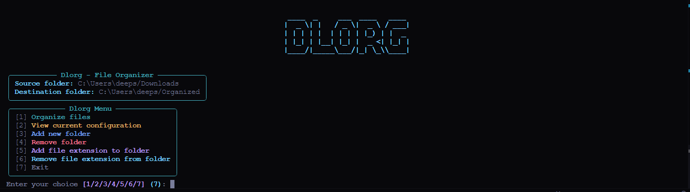
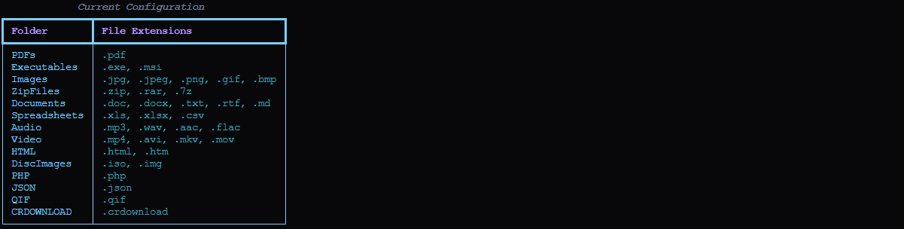

# 📁 Downloads Organizer (dlorg)


[](https://www.python.org/downloads/)
[](https://opensource.org/licenses/MIT)

**dlorg** is a powerful and intuitive Python script that automatically organizes your cluttered Downloads folder into a neatly structured directory system. Say goodbye to the chaos and hello to a tidy digital workspace!

## 🎬 Demo



## 📸 Screenshots

### Main Menu


### Configuration View


## ✨ Features

- 🚀 **Efficient Organization**: Sorts files based on their types into dedicated folders.
- 🎭 **Wide File Support**: Handles various file types including documents, images, videos, and more.
- 🔍 **Smart Recognition**: Automatically detects file types and places them in appropriate folders.
- 🛡️ **Safe Operation**: Doesn't delete any files, just moves them to new locations.
- 🎬 **Demo Mode**: Includes a demonstration mode for testing and presentation purposes.
- 🎨 **Rich CLI Interface**: Utilizes the Rich library for a colorful and interactive command-line interface.
- 🖼️ **ASCII Art Logo**: Features a stylish ASCII art logo for a professional look.
- 📊 **Configuration Management**: Easily view and modify folder configurations through the CLI.

## 🚀 Quick Start

1. Clone the repository:
   ```
   git clone https://github.com/deepspeccode/dlorg.git
   ```

2. Navigate to the dlorg directory:
   ```
   cd dlorg
   ```

3. Install the required dependencies:
   ```
   pip install rich
   ```

4. Run the script:
   ```
   python dlorg.py
   ```

## 📋 Requirements

- Python 3.6 or higher
- Rich library (`pip install rich`)

## 🛠️ Installation

1. Ensure you have Python 3.6+ installed on your system.
2. Clone this repository or download the `dlorg.py` script.
3. Install the Rich library: `pip install rich`

## 🖥️ Usage

### Basic Usage

Run the script from your terminal:

```
python dlorg.py
```

By default, this will organize files from your Downloads folder into a new "Organized" directory in your home folder.

### Custom Paths

You can specify custom source and destination paths:

```
python dlorg.py -s "/path/to/source" -d "/path/to/destination"
```

### Interactive Menu

The script now features an interactive menu with the following options:

1. Organize files
2. View current configuration
3. Add new folder
4. Remove folder
5. Add file extension to folder
6. Remove file extension from folder
7. Exit

## 📁 Folder Structure

After running dlorg, your files will be organized into the following structure:

```
Organized/
├── PDFs/
├── Executables/
├── Images/
├── ZipFiles/
├── Documents/
├── Spreadsheets/
├── Audio/
├── Video/
├── HTML/
├── DiscImages/
├── PHP/
├── JSON/
├── QIF/
└── CRDOWNLOAD/
```

## 🎨 Customization

You can easily customize the script to fit your needs:

- Use the interactive menu to add, remove, or modify folder configurations.
- The configuration is automatically saved to a JSON file for persistence.

## 🤝 Contributing

Contributions, issues, and feature requests are welcome! Feel free to check [issues page](https://github.com/deepspeccode/dlorg/issues).

## 📜 License

This project is [MIT](https://opensource.org/licenses/MIT) licensed.

## 👏 Acknowledgements

- Thanks to all the open-source projects that inspired this tool.
- Special thanks to the Python community for their invaluable resources.
- The Rich library for providing beautiful CLI interfaces.

---

<p align="center">
  Made with ❤️ by DeepSpecCode
</p>
